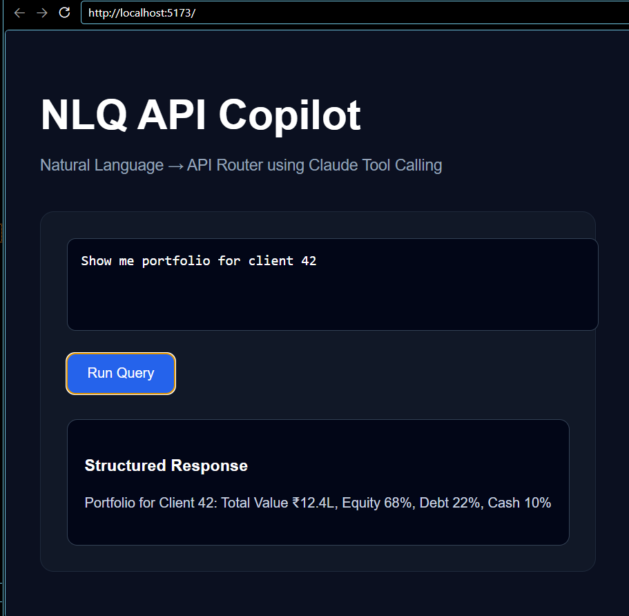
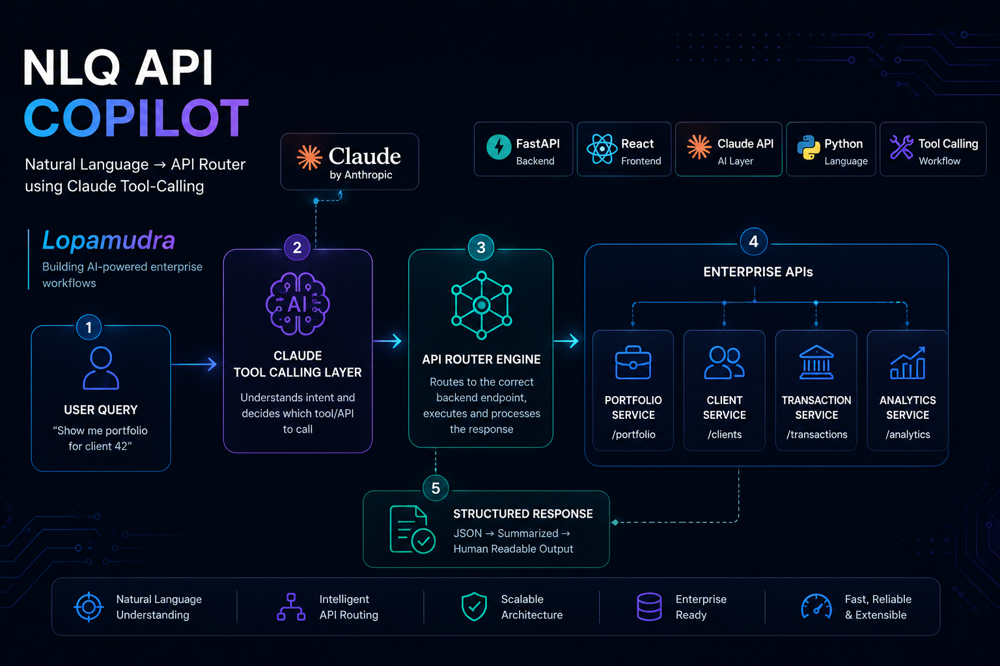

## Demo Preview




# NLQ API Copilot
### Natural Language → API Router using Claude Tool-Calling

> *"Show me portfolio for client 42"* → Claude routes it → structured JSON → plain-English summary

A working demonstration of **agentic AI** applied to wealth management: users type natural-language queries, and the system uses **Claude's tool-calling API** to intelligently route them to the correct backend endpoint, execute the call, and return a human-readable summary.

This mirrors the agentic copilot architecture I built at WaveMaker — rebuilt here as a standalone, open-source demo.

---

## Live Demo


**Sample queries to try:**
- `Show me portfolio for client 42`
- `Get last 5 transactions for client 17`
- `List all advisors and their AUM`
- `What's the current market summary?`

---

## Architecture

```
User Query (NL)
      │
      ▼
 FastAPI Backend
      │
      ├──► Claude claude-opus-4-5  (system prompt + tools)
      │          │
      │          ▼
      │    Tool Selection (tool-calling)
      │    ┌──────────────────────────────┐
      │    │  get_portfolio(client_id)     │
      │    │  get_transactions(id, limit)  │
      │    │  list_advisors()              │
      │    │  get_market_summary()         │
      │    └──────────────────────────────┘
      │          │
      │          ▼
      │    Tool Execution (mock services)
      │          │
      │          ▼
      │    Claude summarises result → NL response
      │
      ▼
 React Frontend (dark terminal UI)
```

**Key patterns demonstrated:**
- **Agentic tool-calling** — Claude decides *which* tool to call and with what parameters
- **Two-turn completion** — query → tool use → result → natural language summary
- **Structured output routing** — LLM as intent classifier + executor
- **REST API design** — clean `/query` endpoint with typed Pydantic request/response

---

## Tech Stack

| Layer    | Technology |
|----------|-----------|
| LLM      | Anthropic Claude claude-opus-4-5 (tool-calling) |
| Backend  | Python · FastAPI · Pydantic |
| Frontend | React 18 · Vite |
| Infra    | Uvicorn · CORS middleware |

---

## Getting Started

### Prerequisites
- Python 3.11+
- Node.js 18+
- [Anthropic API key](https://console.anthropic.com/)

### Backend

```bash
cd backend
pip install -r requirements.txt

export ANTHROPIC_API_KEY=your_key_here   # or set in .env

uvicorn main:app --reload --port 8000
```

Backend runs at `http://localhost:8000`  
API docs: `http://localhost:8000/docs`

### Frontend

```bash
cd frontend
npm install
npm run dev
```

Frontend runs at `http://localhost:3000`

---

## API Reference

### `POST /query`

```json
{
  "query": "Show me portfolio for client 42"
}
```

**Response:**
```json
{
  "query": "Show me portfolio for client 42",
  "tool_used": "get_portfolio",
  "tool_inputs": { "client_id": "42" },
  "data": {
    "client_id": "42",
    "client_name": "Arjun Mehta",
    "total_value": 2847392.50,
    "returns_ytd": 14.3,
    "allocation": { "equities": 60, "debt": 25, "gold": 10, "cash": 5 },
    "risk_profile": "Moderate"
  },
  "summary": "Arjun Mehta's portfolio stands at ₹28.47L with 14.3% YTD returns, following a moderate risk allocation of 60% equities."
}
```

---

## How Tool-Calling Works

Claude receives a list of available tools with their schemas. When a user query maps to a tool, Claude returns a `tool_use` block instead of a text response:

```python
# Claude's response when a tool is needed:
{
  "type": "tool_use",
  "name": "get_portfolio",
  "input": { "client_id": "42" }
}

# We execute the tool, then send the result back to Claude
# Claude then generates a natural-language summary
```

This two-turn pattern is what makes it "agentic" — Claude is not just generating text, it's **deciding what action to take** and **interpreting the result**.

---

## Extending This Project

**Add real data sources:**
- Replace mock functions with actual PostgreSQL queries
- Connect to a real market data API (NSE, Alpha Vantage)

**Add more tools:**
- `rebalance_portfolio(client_id, target_allocation)`
- `send_advisor_alert(advisor_id, message)`
- `generate_client_report(client_id, period)`

**Add memory/context:**
- Maintain conversation history for multi-turn queries
- LangChain or LlamaIndex for RAG over client documents

---

## Related Work

This project is a standalone demo based on the agentic AI copilot architecture I built professionally at WaveMaker, which reduced manual API testing time by 40% across wealth management workflows.

See my [LinkedIn](https://www.linkedin.com/in/lopamudra-bisoyi/) for the full context.

---

## License

MIT
